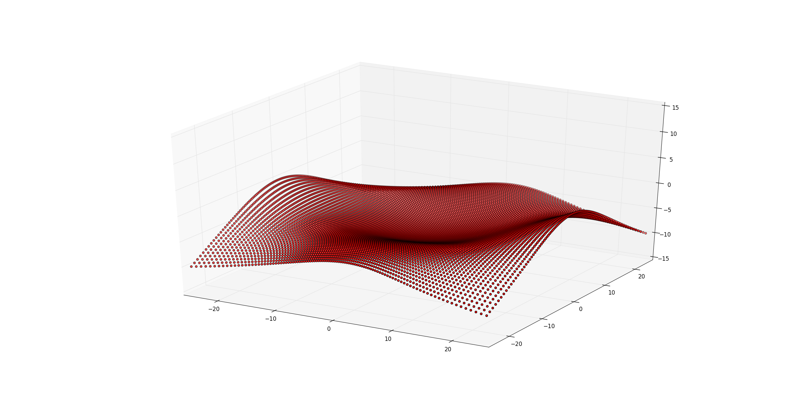
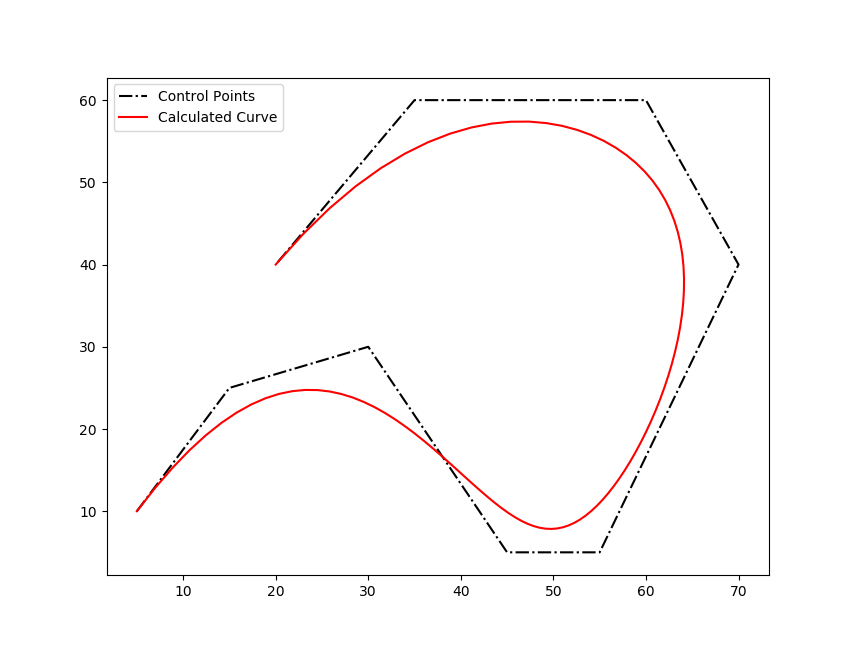

# Non-Uniform Rational Basis Spline (NURBS) Python Package

## Introduction

This project aims to implement the NURBS curve and surface calculation algorithms in native Python. It currently implements the following algorithms from **The NURBS Book** by Piegl & Tiller:

* Algorithm A2.1: FindSpan
* Algorithm A2.2: BasisFuns
* Algorithm A3.1: CurvePoint
* Algorithm A3.5: SurfacePoint
* Algorithm A4.1: CurvePoint (from weighted control points)
* Algorithm A4.3: SurfacePoint (from weighted control points)

### What is NURBS, by the way?

Non-Uniform Rational B-Spline (NURBS) is a mathematical model used commonly in computer graphics and CAD systems for generating and representing curves and surfaces. For details, you can check [the related Wikipedia article](https://en.wikipedia.org/wiki/Non-uniform_rational_B-spline) or [The NURBS Book](http://www.springer.com/gp/book/9783642973857) by Les Piegl and Wayne Tiller.

## Tested with
* Python v2.7.12 & Python v3.5.3
* Matplotlib v2.0.0

## Contents of the repository

* `nurbs\` directory includes the NURBS libraries
* `data\` directory includes sample control points for curves and surfaces
* `ex*.py` files are testing scripts for curve and surface calculations

Check the examples for using `Surface` and `Curve` classes and automatic knot vector generation functions.

## Example Outputs

### File: ex01_surface1.py

### File: ex02_curve1.py

## Author

* Onur Rauf Bingol
