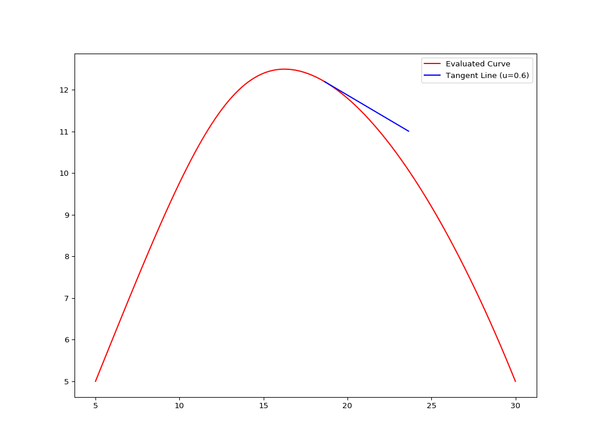
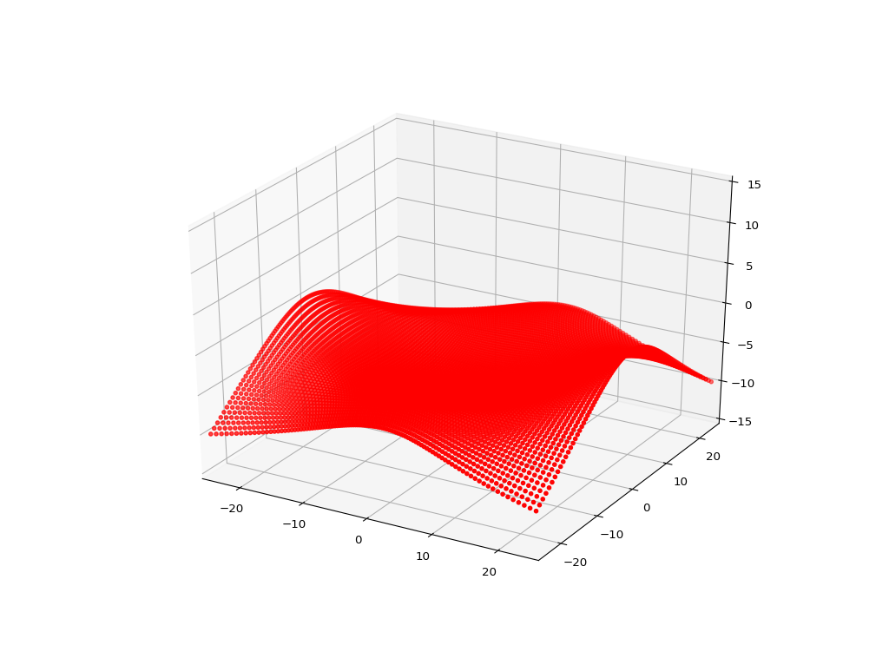
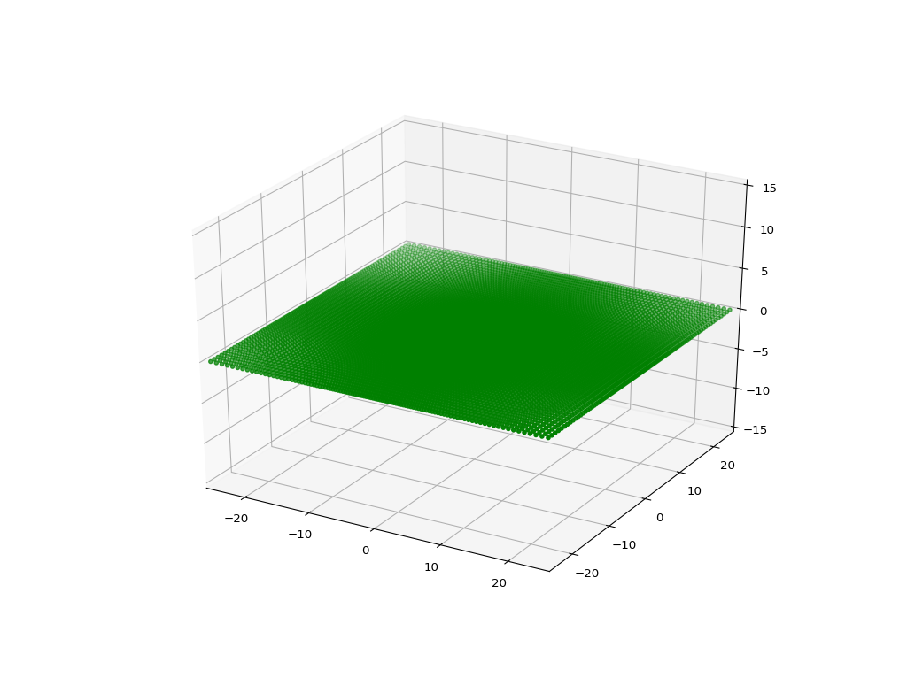

# Non-Uniform Rational Basis Spline (NURBS) Python Package

## Introduction

This project aims to implement the NURBS curve and surface calculation algorithms in native Python. It currently implements the following algorithms from **The NURBS Book** by Piegl & Tiller:

* Algorithm A2.1: FindSpan
* Algorithm A2.2: BasisFuns
* Algorithm A2.3: DersBasisFuns
* Algorithm A3.1: CurvePoint
* Algorithm A3.2: CurveDerivsAlg1
* Algorithm A3.3: CurveDerivCpts
* Algorithm A3.4: CurveDerivsAlg2
* Algorithm A3.5: SurfacePoint
* Algorithm A3.6: SurfaceDerivsAlg1
* Algorithm A4.1: CurvePoint (from weighted control points)
* Algorithm A4.3: SurfacePoint (from weighted control points)

## Minimum Requirements

One of the major goals of this project is implementing all these algorithms with minimum dependencies. Currently, the NURBS package can run with plain Python and therefore, it has no extra dependencies, like NumPy or similar. The code was tested with Python versions 2.7.12 and 3.5.3.

On the other hand, the plotting part of the examples requires Matplotlib installed in your Python distribution. If you don't need any plotting, you basically won't need Matplotlib at all.

## Contents of the repository

* `nurbs\` directory includes the NURBS libraries
* `data\` directory includes sample control points for curves and surfaces
* `ex*.py` files are testing scripts for curve and surface calculations

Please check the examples for details of `Surface` and `Curve` classes and automatic knot vector generation functions. Details of the control points file formats are discussed in [Formats](doc/Formats.md).

## Example Outputs

### File: ex_curve01.py

Displays the control points polygon and the evaluated curve using the an auto-generated uniform knot vector.

### File: ex_curve02.py

Displays the evaluated curve using an auto-generated uniform knot vector and the tangent vector at u = 0.6.

### File: ex_surface01.py

### File: ex_surface02.py

### File: ex_surface03.py

Thanks to @jedufour for `ex_surface03.py` example.

## Issues and Reporting

If you have any questions related to the NURBS-Python package, please don't hesitate to contact the author.

## Author

* Onur Rauf Bingol (@orbingol)

## Contributors

* John-Eric Dufour (@jedufour)
