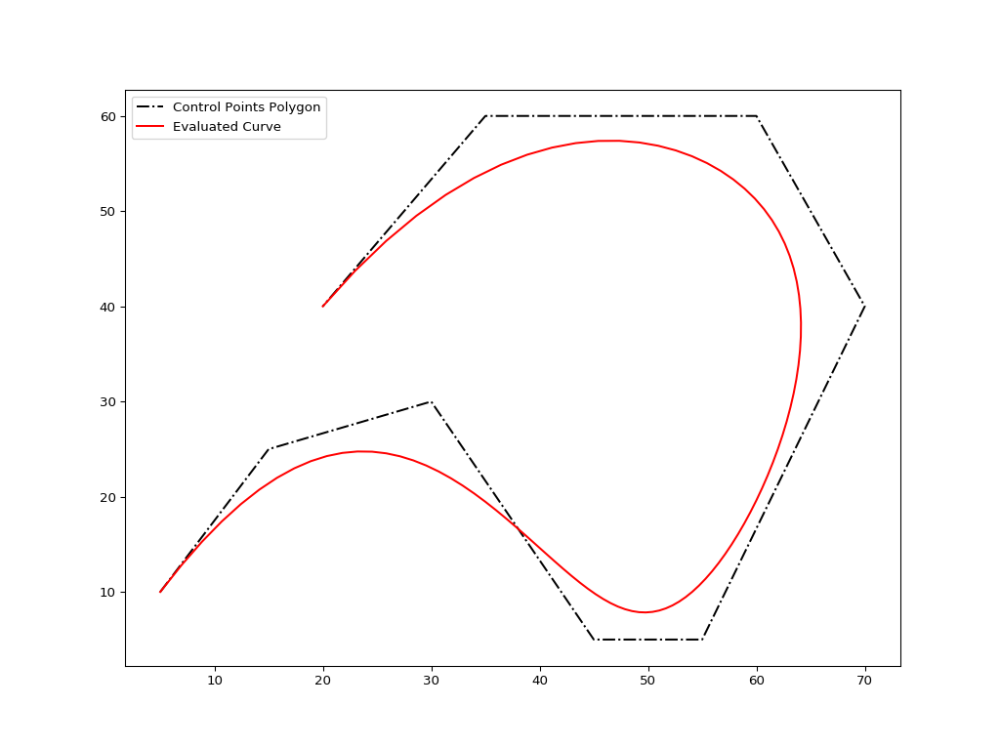
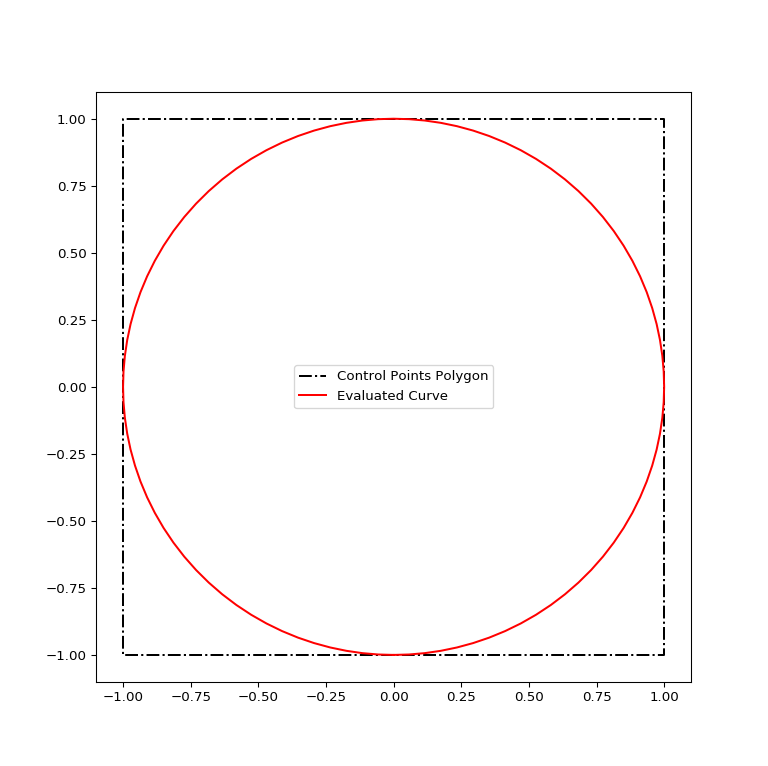
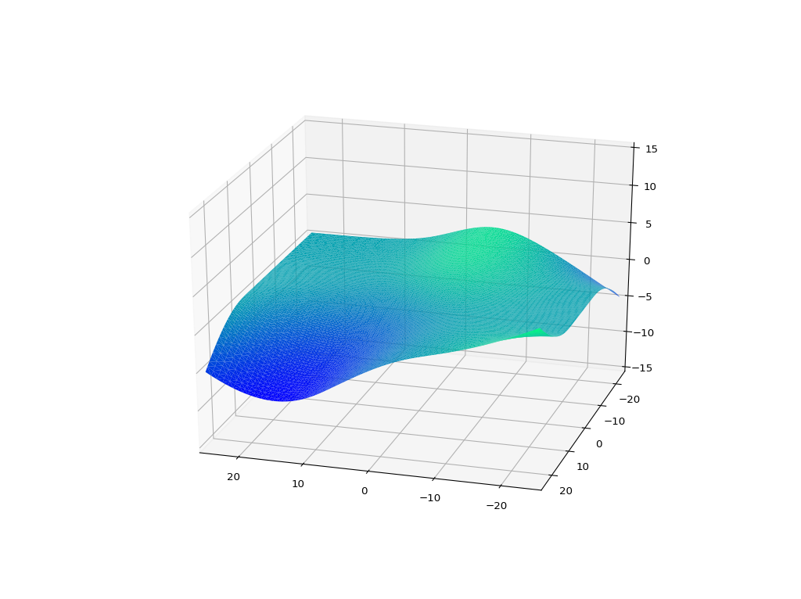

# Non-Uniform Rational Basis Spline (NURBS) Python Package

## Introduction

This project aims to implement the NURBS curve and surface computation algorithms in native Python. Currently, the `Curve` and `Surface` classes can be used for data storage and evaluation of B-Spline and NURBS curves and surfaces.

Additionally, `Grid` class can be used to generate simple 2D control point grids for use with the `Surface` class.

## Description of the Package

### Algorithms

NURBS-Python currently implements the following algorithms from **The NURBS Book** by Piegl & Tiller:

* Algorithm A2.1: FindSpan
* Algorithm A2.2: BasisFuns
* Algorithm A2.3: DersBasisFuns
* Algorithm A3.1: CurvePoint
* Algorithm A3.2: CurveDerivsAlg1
* Algorithm A3.3: CurveDerivCpts
* Algorithm A3.4: CurveDerivsAlg2
* Algorithm A3.5: SurfacePoint
* Algorithm A3.6: SurfaceDerivsAlg1
* Algorithm A4.1: CurvePoint (from weighted control points)
* Algorithm A4.3: SurfacePoint (from weighted control points)

### Data Structure

The data structure in `Curve` and `Surface` classes is implemented using [Python properties](https://docs.python.org/2/library/functions.html#property). The following table shows the properties defined in these classes:

| Curve Properties | Surface Properties | Notes | 
| :---: | :---: | :---: |
| degree | degree_u | Degree of the curve/surface|
| | degree_v | |
| knotvector | knotvector_u | Knot vectors|
| | knotvector_v | |
| ctrlpts | ctrlpts | 1D array of control points |
| | ctrlpts2D | 2D array of control points in _\[u\]\[v\]_ format |
| ctrlptsw | ctrlptsw | 1D array of weighted control points |
| weights | weights | Weights vector |
| delta | delta | Evaluation delta for knots |
| curvepts | surfpts | Evaluated points |

### Evaluation Methods

After setting the required parameters, the curve or the surface can be evaluated using `evaluate()` or `evaluate_rational()` methods. Then, the evaluated curve points can be obtained from `curvepts` property and the evaluated surface points can be obtained from `surfpts` property. The curve and surface derivatives can be evaluated using `derivatives()` method. An easy way to get 1st derivatives using `tangent()` method is available in both classes.

`Surface` class has methods for transposing the surface by swapping U and V directions, `tranpose()`, and finding surface normals, `normal()`.

### Reading Control Points

Both classes have `read_ctrlpts()` and `read_ctrlptsw()` methods for reading control points and weighted control points, respectively, from a text file. The details on the file format are explained in [FORMATS.md](FORMATS.md) file.
 
### Additional Features

`utilities` module has some extra features for several mathematical operations:

* `autogen_knotvector()` generates a uniform knot vector according to the input degree and number of control points
* `normalize_knotvector()` normalizes the knot vector between 0 and 1
* `cross_vector()` computes the cross production of the input vectors
* `normalize_vector()` generates a unit vector from the input vector

Other functions in the `utilities` module are used as helper functions in evaluation methods of `Curve` and `Surface` classes.

### 2D Grid Generation

`Grid` module is capable of generating simple 2D control point grids for use with the `Surface` class. Please check [ex_grid01.py](ex_grid01.py) file and the documentation for details on how to use the `Grid` class and its features.

## Minimum Requirements

One of the major goals of this project is implementing all these algorithms with minimum dependencies. Currently, the NURBS package can run with plain Python and therefore, it has no extra dependencies, like NumPy or similar. The code was tested with Python versions 2.7.12 and 3.5.3.

On the other hand, the plotting part of the examples requires Matplotlib installed in your Python distribution. If you don't need any plotting, you basically won't need Matplotlib at all.

## Contents of the repository

* `nurbs\` directory includes the `Curve` and `Surface` classes along with the `utilities` module
* `ex*.py` files are testing scripts for demonstrating curve and surface evaluations
* `data\` directory contains sample control points for the testing scripts

## How to use NURBS-Python Package

### Coding Examples

**Curves:**

* [ex_curve01.py](ex_curve01.py)
* [ex_curve02.py](ex_curve02.py)
* [ex_curve03.py](ex_curve03.py)
* [ex_curve04.py](ex_curve04.py) _(A full circle)_

**Surfaces:**

* [ex_surface01.py](ex_surface01.py)
* [ex_surface02.py](ex_surface02.py)
* [ex_surface03.py](ex_surface03.py)

**Grid Generator**

* [ex_grid01.py](ex_grid01.py)

### Plots

The following plots are generated using [Matplotlib](http://matplotlib.org/).

#### File: ex_curve01.py

Displays the control points polygon and the evaluated curve using the an auto-generated uniform knot vector.

#### File: ex_curve02.py

Displays the evaluated curve using an auto-generated uniform knot vector and the tangent vector at u = 0.6.

#### File: ex_curve03.py

Displays the control points polygon and the evaluated curve using the an auto-generated uniform knot vector. Tangent vectors are shown in quiver plots.

#### File: ex_curve04.py

Displays the control points polygon and the evaluated NURBS curve for a full circle.

#### File: ex_surface01.py

#### File: ex_surface02.py

#### File: ex_surface03.py

Thanks to [@jedufour](https://github.com/jedufour) for `ex_surface03.py` example.

## Issues and Reporting

If you have any questions related to the NURBS-Python package, please don't hesitate to contact the author.

## Author

* Onur Rauf Bingol ([@orbingol](https://github.com/orbingol))

## Contributors

* John-Eric Dufour ([@jedufour](https://github.com/jedufour)), bug fixing and contribution of surface example 3
* Jan Heczko ([@heczis](https://github.com/heczis)), bug fixing

## License

[MIT](LICENSE)

## Acknowledgments

I would like to thank my PhD adviser, [Dr. Adarsh Krishnamurthy](https://www.me.iastate.edu/faculty/?user_page=adarsh), for his guidance and supervision throughout the course of this project. If you are interested in this Python package, please have a look at [our research group's web page](http://web.me.iastate.edu/idealab/) for more projects and contact information.
