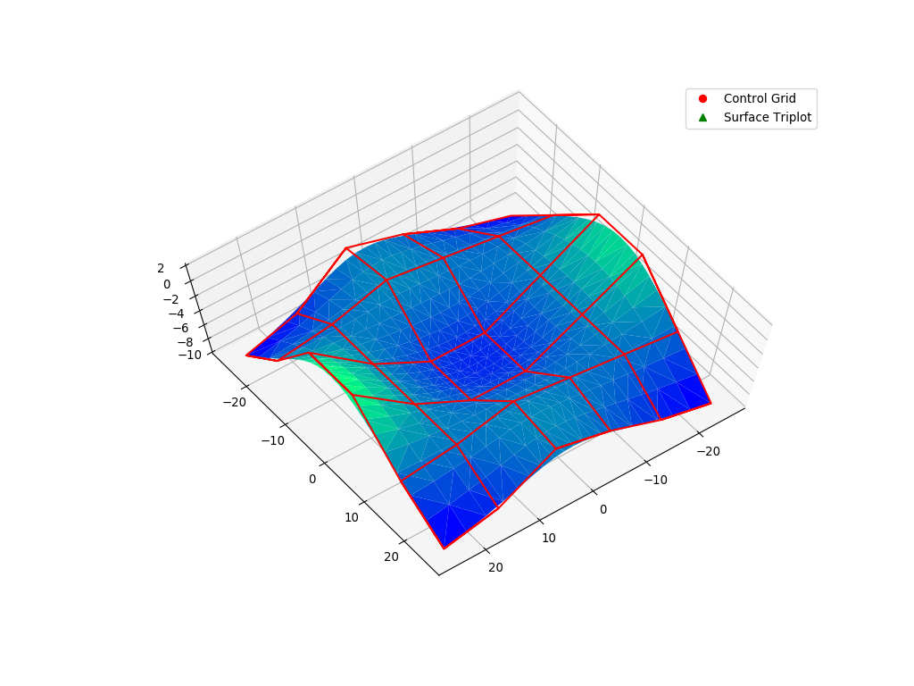
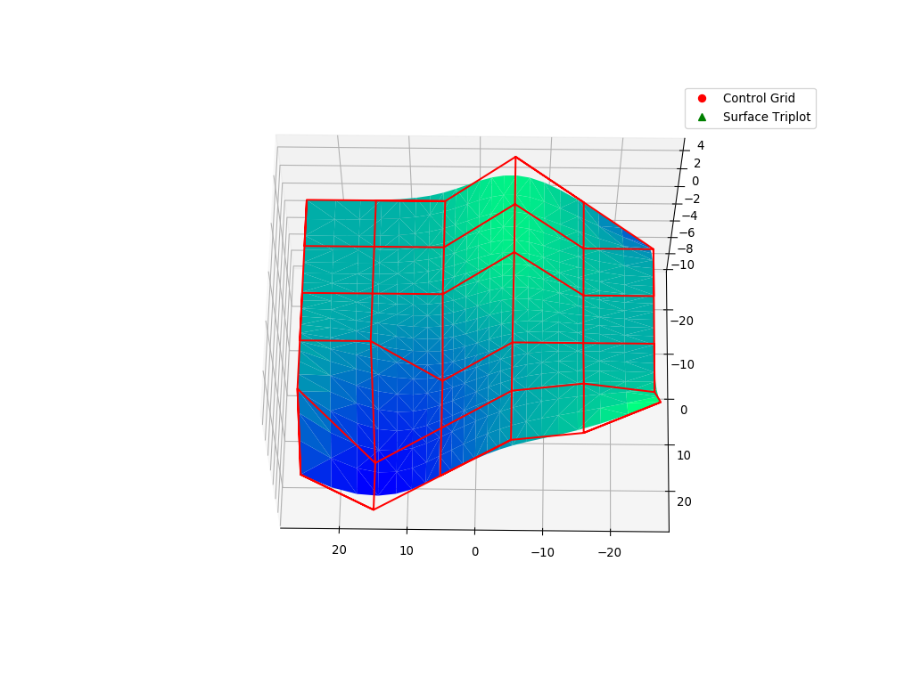
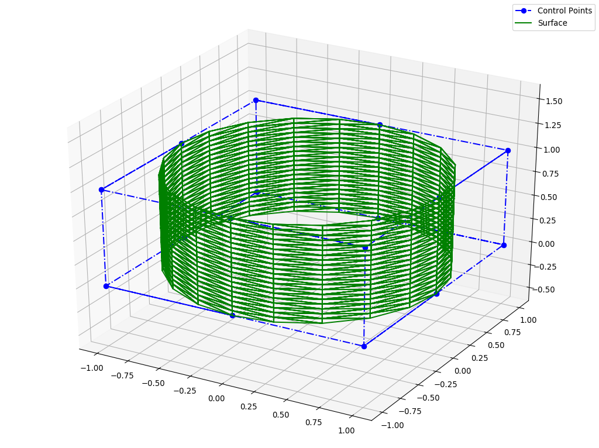

Visualization
^^^^^^^^^^^^^^

Visualization Component
=======================

NURBS-Python v3.x series included an optional visualization module for plotting evaluated curves and surfaces. Examples_
repository contains some examples on how to use the visualization component with surfaces and 2D/3D curves which are

* ``curve2d/ex_curve01.py``
* ``curve3d/ex_curve3d01.py``
* ``surface/ex_surface01.py``

Advanced Visualization Options
==============================

``visualization/`` directory in the Examples_ repository contains customizable scripts for more advanced visualization
using `Matplotlib <https://matplotlib.org>`_.

Examples
========

The following examples illustrate the visualization component which comes with the NURBS-Python package and
the advanced visualization options using the scripts in the Examples_ repository.

Surfaces
--------

The following figures are generated using `Matplotlib v2.1.0 <https://matplotlib.org>`_ from the outputs of the examples
shared in the Examples_ repository. Please see :ref:`formats` section on details of CSV exporting capabilities.
Visualization scripts can be found in the Examples_ repository under ``visualization`` directory.

ex_surface01.py
~~~~~~~~~~~~~~~

* Control points CSV export mode: ``wireframe``
* Surface points CSV export mode: ``linear``
* Evaluation delta: 0.05
* Script used: ``mpl_wframe_trisurf.py``

ex_surface02.py
~~~~~~~~~~~~~~~

* Control points CSV export mode: ``wireframe``
* Surface points CSV export mode: ``linear``
* Evaluation delta: 0.05
* Script used: ``mpl_wframe_trisurf.py``

ex_surface03.py
~~~~~~~~~~~~~~~

* Control points CSV export mode: ``linear``
* Surface points CSV export mode: ``wireframe``
* Evaluation delta: 0.05
* Script used: ``mpl_scatter_wframe.py``

Curves
------

Coming soon!

.. _Examples: https://github.com/orbingol/NURBS-Python_Examples
