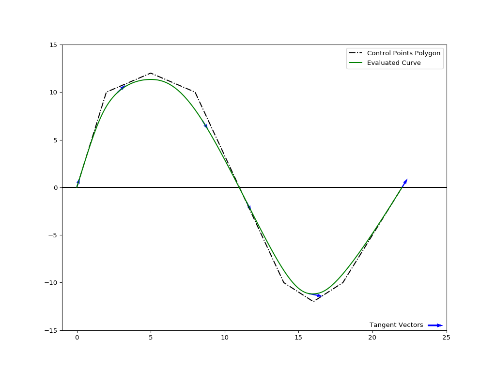
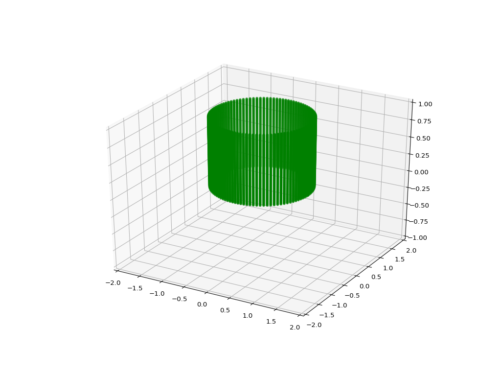

.. NURBS-Python documentation master file, created by
   sphinx-quickstart on Fri Mar 10 21:16:25 2017.
   You can adapt this file completely to your liking, but it should at least
   contain the root `toctree` directive.

NURBS-Python Documentation
==========================

Introduction
------------

.. automodule:: geomdl
    :members:
    :undoc-members:

Q&A
^^^

**What is NURBS?**

NURBS, namely *Non-Uniform Rational Basis Spline*, is a mathematical model for generation of curves and surfaces in a flexible way. It is a well-accepted industry standard and used as a basis for nearly all of the 3D modeling and CAD/CAM software packages.
Please see the `the related Wikipedia article <https://en.wikipedia.org/wiki/Non-uniform_rational_B-spline>`_ or `The NURBS Book <http://www.springer.com/gp/book/9783642973857>`_, a very nice and informative book written by Dr. Piegl and Dr. Tiller.

**What is the purpose of this package/library?**

Very simple: Implementing the well-known NURBS algorithms in native Python, i.e. without using any converters or wrappers, like `SWIG <http://www.swig.org/>`_ or `Boost.Python <https://github.com/boostorg/python>`_. This approach comes with some advantages in debugging and implementing new algorithms.

Current version of the library doesn't require any additional packages, such as NumPy, so that you can run **NURBS-Python** on a plain Python installation.

The first version of the library was very complicated to use (I developed that version as a class project), so I started developing an alternative, easy-to-use NURBS library with simple data storage functionality, and now, here we are!

**Can I request a new feature?**

Of course you can :-) Please feel free to contact me about the NURBS-Python package anytime you want.

* `Github <https://github.com/orbingol>`_ (you can find my email there)
* Twitter: `@orbingol <https://twitter.com/orbingol>`_

Graphical Outputs
-----------------

The following 2D and 3D plots are generated using `Matplotlib <http://matplotlib.org/>`_. You can find the scripts generating these graphical outputs in the `NURBS-Python Repository <https://github.com/orbingol/NURBS-Python>`_.

Curves
^^^^^^

.. image:: images/ex_curve01.png
    :alt: Curve example

.. image:: images/ex_curve04.png
    :alt: A full circle using NURBS

Surfaces
^^^^^^^^

.. image:: images/ex_surface01.png
    :alt: Surface example 1

.. image:: images/ex_surface02.png
    :alt: Surface example 2

Submodules
----------

The :code:`geomdl` package contains :code:`BSpline` and :code:`NURBS` modules along with the :code:`utilities` module for functions common in both :code:`BSpline` and :code:`NURBS`.

This package also includes a simple grid generator class, :code:`Grid`, to generate rectangular control point grids for use with :code:`BSpline.Surface` and :code:`NURBS.Surface` classes.

BSpline module
^^^^^^^^^^^^^^

:code:`BSpline` class provides data storage properties and evaluation functions for B-spline (NUBS) curves and surfaces.

3D B-Spline Curve
~~~~~~~~~~~~~~~~~

.. autoclass:: geomdl.BSpline.Curve
    :members:
    :undoc-members:
    :inherited-members:
    :show-inheritance:

2D B-Spline Curve
~~~~~~~~~~~~~~~~~

.. autoclass:: geomdl.BSpline.Curve2D
    :members:
    :undoc-members:
    :inherited-members:
    :show-inheritance:

B-Spline Surface
~~~~~~~~~~~~~~~~

.. autoclass:: geomdl.BSpline.Surface
    :members:
    :undoc-members:
    :inherited-members:
    :show-inheritance:

NURBS module
^^^^^^^^^^^^

:code:`NURBS` class provides data storage properties and evaluation functions for NURBS curves and surfaces.

3D NURBS Curve
~~~~~~~~~~~~~~

.. autoclass:: geomdl.NURBS.Curve
    :members:
    :undoc-members:
    :inherited-members:
    :show-inheritance:

2D NURBS Curve
~~~~~~~~~~~~~~

.. autoclass:: geomdl.NURBS.Curve2D
    :members:
    :undoc-members:
    :inherited-members:
    :show-inheritance:

NURBS Surface
~~~~~~~~~~~~~

.. autoclass:: geomdl.NURBS.Surface
    :members:
    :undoc-members:
    :inherited-members:
    :show-inheritance:

Utilities module
^^^^^^^^^^^^^^^^

:code:`utilities` module contains common helper functions for B-spline and NURBS curve and surface evaluation.

.. automodule:: geomdl.utilities
    :members:
    :exclude-members: basis_functions, basis_functions_all, basis_functions_ders, check_uv, find_span, find_multiplicity
    :undoc-members:

Control Points Generator
^^^^^^^^^^^^^^^^^^^^^^^^

:code:`Grid` class provides an easy way to generate control point grids for use with :code:`BSpline.Surface` class and :code:`GridWeighted` does the same for :code:`NURBS.Surface` class.

This class is designed minimally just to enable more testing cases for :code:`BSpline.Surface` and :code:`NURBS.Surface` classes. It is not a fully-featured grid generator which can fit to any purpose, but as always, contributions are welcome!

Grid
~~~~

.. autoclass:: geomdl.CPGen.Grid
    :members:
    :undoc-members:
    :inherited-members:
    :show-inheritance:

Weighted Grid
~~~~~~~~~~~~~

.. autoclass:: geomdl.CPGen.GridWeighted
    :members:
    :undoc-members:
    :inherited-members:
    :show-inheritance:

.. toctree::
    :maxdepth: 2

.. Indices and tables
.. ==================

.. * :ref:`genindex`
.. * :ref:`modindex`
.. * :ref:`search`
