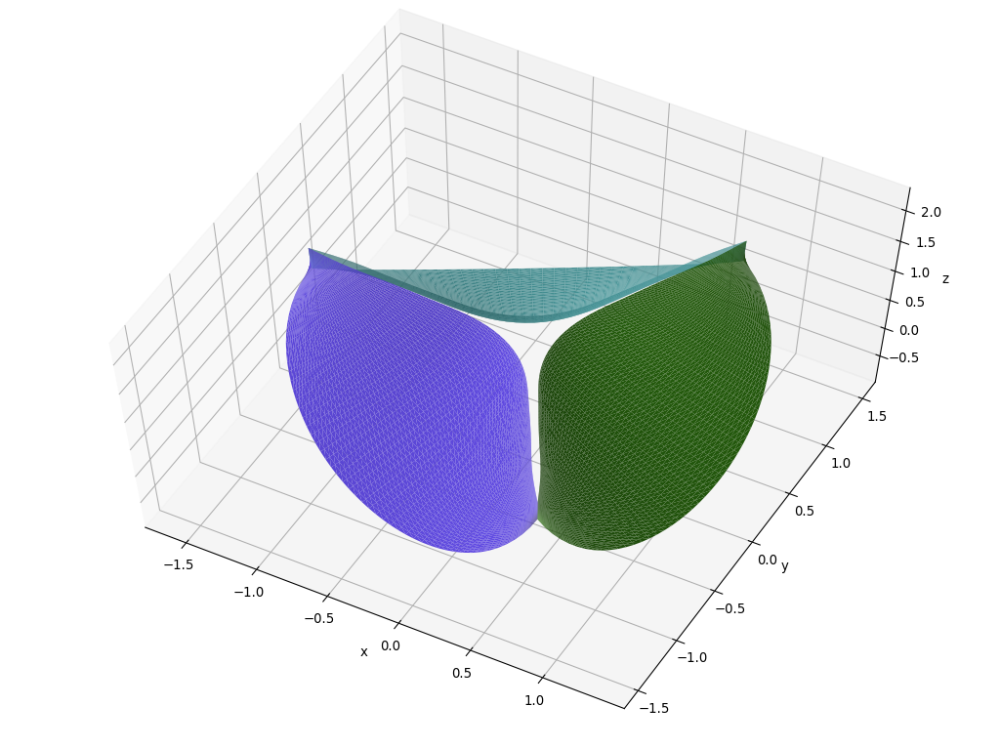

Geometry Containers
^^^^^^^^^^^^^^^^^^^

The ``multi`` module provides specialized geometry containers. A container is a holder object that stores a collection
of other objects, i.e. its elements. In NURBS-Python, containers can be generated as a result of

* A geometric operation, such as **splitting**
* File import, e.g. reading a file or a set of files containing multiple surfaces

The ``multi`` module contains the following classes:

* :py:class:`.AbstractContainer` abstract base class for containers
* :py:class:`.CurveContainer` for storing multiple curves
* :py:class:`.SurfaceContainer` for storing multiple surfaces
* :py:class:`.VolumeContainer` for storing multiple volumes

How to Use
==========

These containers can be used for many purposes, such as visualization of a multi-component geometry or file export.
For instance, the following figure shows a heart valve with 3 leaflets:

Each leaflet is a NURBS surface added to a :py:class:`.SurfaceContainer` and rendered via Matplotlib visualization
module. It is possible to input a list of colors to the ``render`` method, otherwise it will automatically pick an
arbitrary color.

Inheritance Diagram
===================

.. inheritance-diagram:: geomdl.multi

Abstract Container
==================

.. autoclass:: geomdl.multi.AbstractContainer
    :members:
    :inherited-members:
    :show-inheritance:

Curve Container
===============

.. autoclass:: geomdl.multi.CurveContainer
    :members:
    :inherited-members:
    :show-inheritance:

Surface Container
=================

.. autoclass:: geomdl.multi.SurfaceContainer
    :members:
    :inherited-members:
    :show-inheritance:

Volume Container
=================

.. autoclass:: geomdl.multi.VolumeContainer
    :members:
    :inherited-members:
    :show-inheritance:
