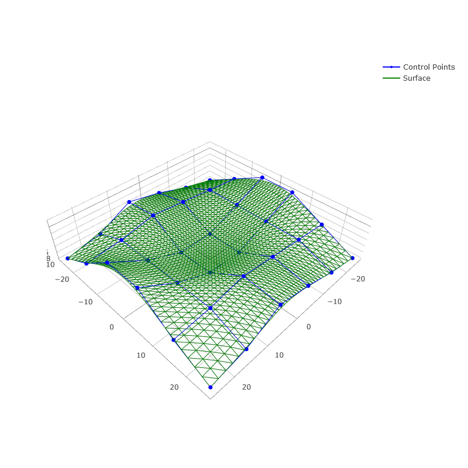
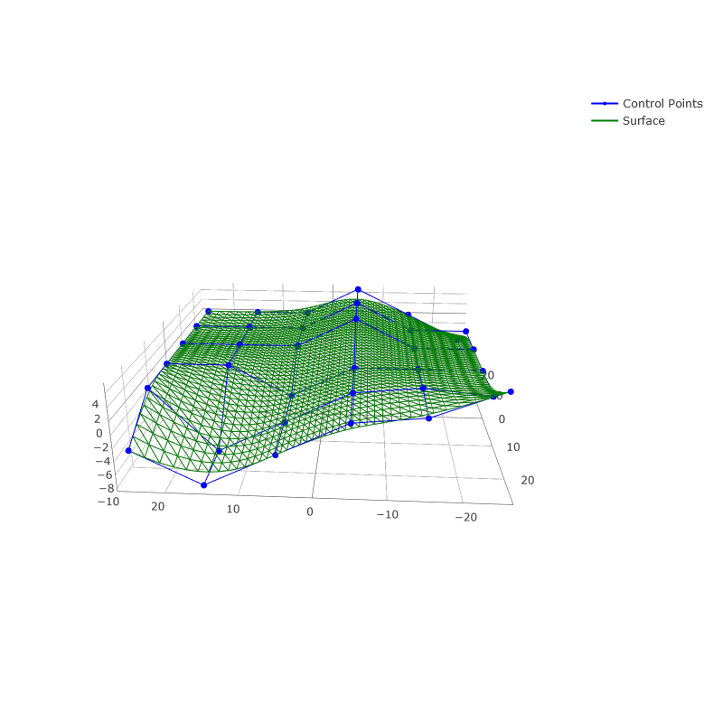
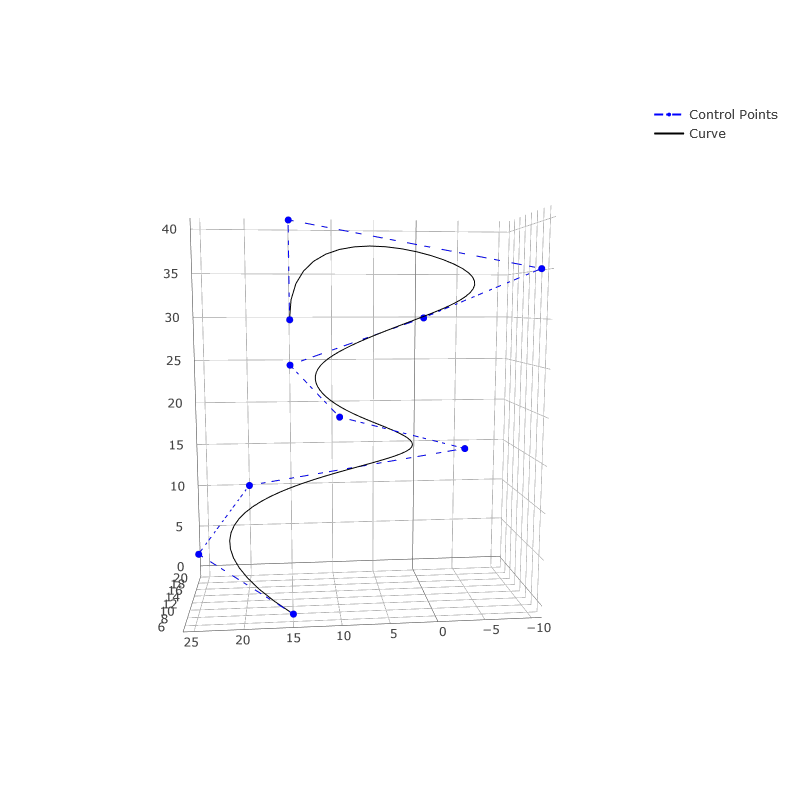

Visualization
^^^^^^^^^^^^^

NURBS-Python comes with the following visualization modules for direct plotting evaluated curves and surfaces:

* :doc:`VisMPL <module_vis_mpl>` module for `Matplotlib <https://matplotlib.org>`_
* :doc:`VisPlotly <module_vis_plotly>` module for `Plotly <https://plot.ly/python/>`_

Examples_ repository contains examples on how to use the visualization components with surfaces and curves. Please see
:doc:`Visualization Modules Documentation <modules_visualization>` for more details.

Examples
========

The following figures illustrate some example 2D/3D curves and surfaces that can be generated and directly visualized
using NURBS-Python.

Surfaces
--------

.. plot::

    from geomdl import BSpline
    from geomdl.visualization import VisMPL

    # Control points
    ctrlpts = [
        [[-25.0, -25.0, -10.0], [-25.0, -15.0, -5.0], [-25.0, -5.0, 0.0], [-25.0, 5.0, 0.0], [-25.0, 15.0, -5.0], [-25.0, 25.0, -10.0]],
        [[-15.0, -25.0, -8.0], [-15.0, -15.0, -4.0], [-15.0, -5.0, -4.0], [-15.0, 5.0, -4.0], [-15.0, 15.0, -4.0], [-15.0, 25.0, -8.0]],
        [[-5.0, -25.0, -5.0], [-5.0, -15.0, -3.0], [-5.0, -5.0, -8.0], [-5.0, 5.0, -8.0], [-5.0, 15.0, -3.0], [-5.0, 25.0, -5.0]],
        [[5.0, -25.0, -3.0], [5.0, -15.0, -2.0], [5.0, -5.0, -8.0], [5.0, 5.0, -8.0], [5.0, 15.0, -2.0], [5.0, 25.0, -3.0]],
        [[15.0, -25.0, -8.0], [15.0, -15.0, -4.0], [15.0, -5.0, -4.0], [15.0, 5.0, -4.0], [15.0, 15.0, -4.0], [15.0, 25.0, -8.0]],
        [[25.0, -25.0, -10.0], [25.0, -15.0, -5.0], [25.0, -5.0, 2.0], [25.0, 5.0, 2.0], [25.0, 15.0, -5.0], [25.0, 25.0, -10.0]]
    ]

    # Create a BSpline surface
    surf = BSpline.Surface()

    # Set degrees
    surf.degree_u = 3
    surf.degree_v = 3

    # Set control points
    surf.ctrlpts2d = ctrlpts

    # Set knot vectors
    surf.knotvector_u = [0.0, 0.0, 0.0, 0.0, 1.0, 2.0, 3.0, 3.0, 3.0, 3.0]
    surf.knotvector_v = [0.0, 0.0, 0.0, 0.0, 1.0, 2.0, 3.0, 3.0, 3.0, 3.0]

    # Set evaluation delta
    surf.delta = 0.025

    # Evaluate surface points
    surf.evaluate()

    # Import and use Matplotlib's colormaps
    from matplotlib import cm

    # Plot the control points grid and the evaluated surface
    surf.vis = VisMPL.VisSurface()
    surf.render(colormap=cm.cool)

-----

-----

.. image:: images/ex_surface01_mpl_wf.png
    :alt: Surface example 1 - wireframe model

ex_surface02.py
~~~~~~~~~~~~~~~

.. image:: images/ex_surface02_mpl.png
    :alt: Surface example 2 with Matplotlib

-----

ex_surface03.py
~~~~~~~~~~~~~~~

.. image:: images/ex_surface03_mpl.png
    :alt: Surface example 3 with Matplotlib

-----

.. image:: images/ex_surface03_plotly.png
    :alt: Surface example 3 with Plotly

mpl_trisurf_vectors.py
~~~~~~~~~~~~~~~~~~~~~~

The following figure illustrates tangent and normal vectors on ``ex_surface02.py`` example.
The example script can be found in Examples_ repository under the ``visualization`` directory.

.. image:: images/ex_surface02_mpl_vectors.png
    :alt: Surface example 2 with tangent and normal vectors

2D Curves
---------

ex_curve01.py
~~~~~~~~~~~~~

.. image:: images/ex_curve01_vis.png
    :alt: 2D curve example 1

ex_curve02.py
~~~~~~~~~~~~~

.. image:: images/ex_curve02_vis.png
    :alt: 2D curve example 2

ex_curve03.py
~~~~~~~~~~~~~

.. image:: images/ex_curve03_vis.png
    :alt: 2D curve example 3

ex_curve04.py
~~~~~~~~~~~~~

.. image:: images/ex_curve04_vis.png
    :alt: 2D curve example 4

3D Curves
---------

ex_curve3d01.py
~~~~~~~~~~~~~~~

.. image:: images/ex_curve3d01_vis.png
    :alt: 3D curve example 1

ex_curve3d02.py
~~~~~~~~~~~~~~~

.. image:: images/ex_curve3d02_vis.png
    :alt: 3D curve example 2 with Matplotlib

-----

Advanced Visualization for 2D/3D Curves
---------------------------------------

The following example scripts can be found in Examples_ repository under the ``visualization`` directory.

mpl_curve2d_tangents.py
~~~~~~~~~~~~~~~~~~~~~~~

This example illustrates a more advanced visualization option for plotting the 2D curve tangents alongside with the
control points grid and the evaluated curve.

.. image:: images/ex_curve03_mpl.png
    :alt: 2D curve example 2 with tangent vector quiver plots

mpl_curve3d_tangents.py
~~~~~~~~~~~~~~~~~~~~~~~

This example illustrates a more advanced visualization option for plotting the 3D curve tangents alongside with the
control points grid and the evaluated curve.

.. image:: images/ex_curve3d01_mpl.png
    :alt: 3D curve example 1 with tangent vector quiver plots

mpl_curve3d_vectors.py
~~~~~~~~~~~~~~~~~~~~~~

This example illustrates a visualization option for plotting the 3D curve tangent, normal and binormal vectors
alongside with the control points grid and the evaluated curve.

.. image:: images/ex_curve3d02_mpl.png
    :alt: 3D curve example 2 with tangent, normal and binormal vector quiver plots

.. _Examples: https://github.com/orbingol/NURBS-Python_Examples
