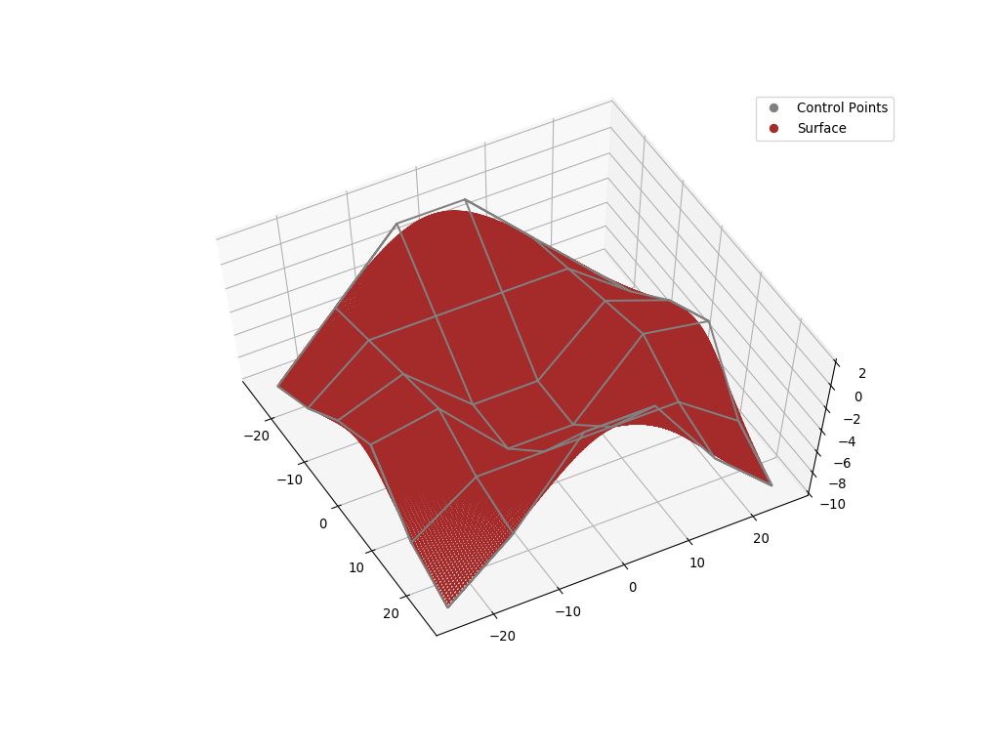
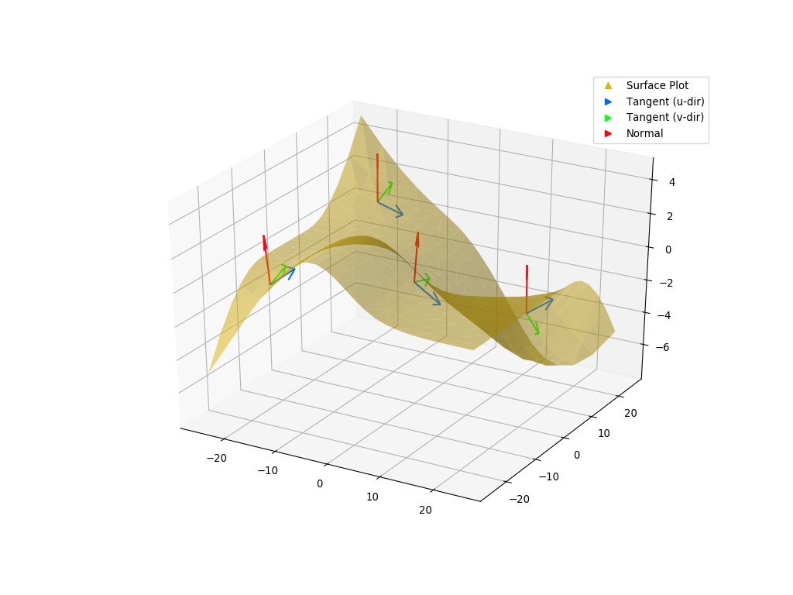
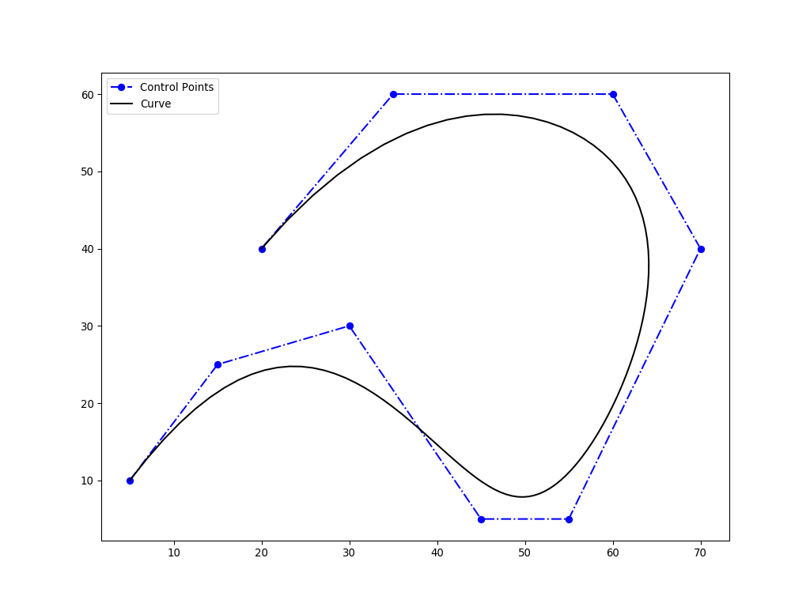
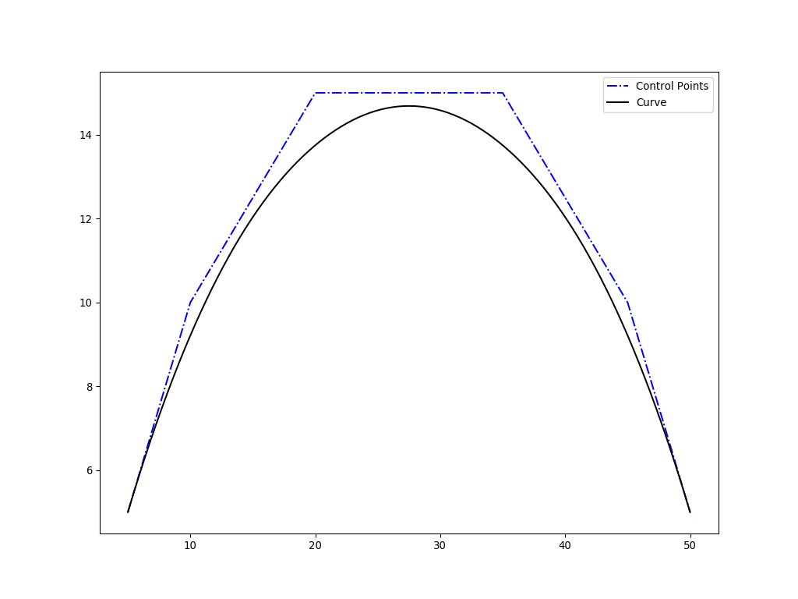
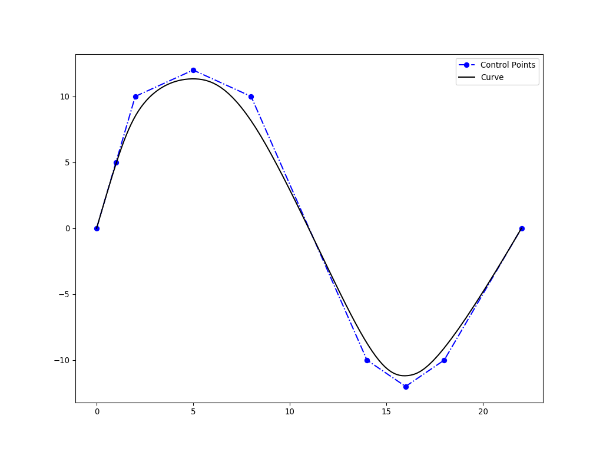
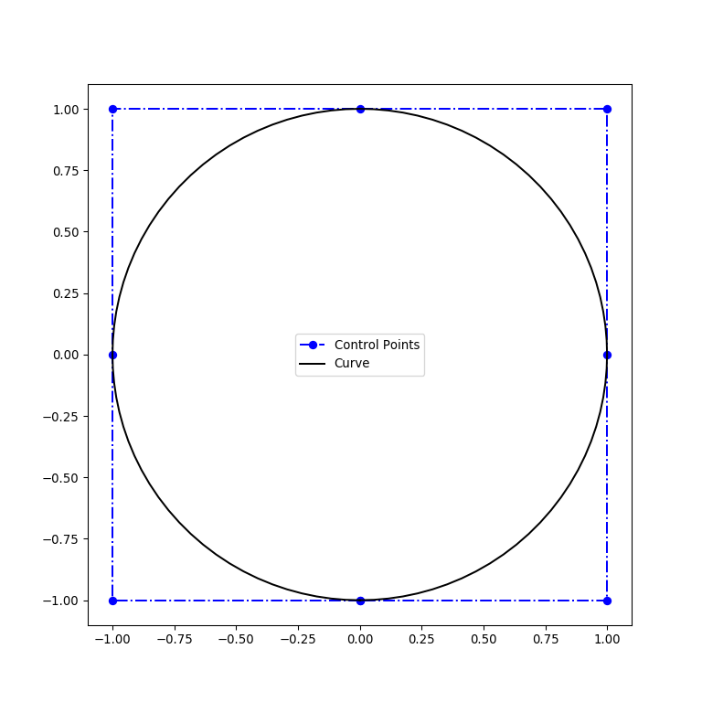
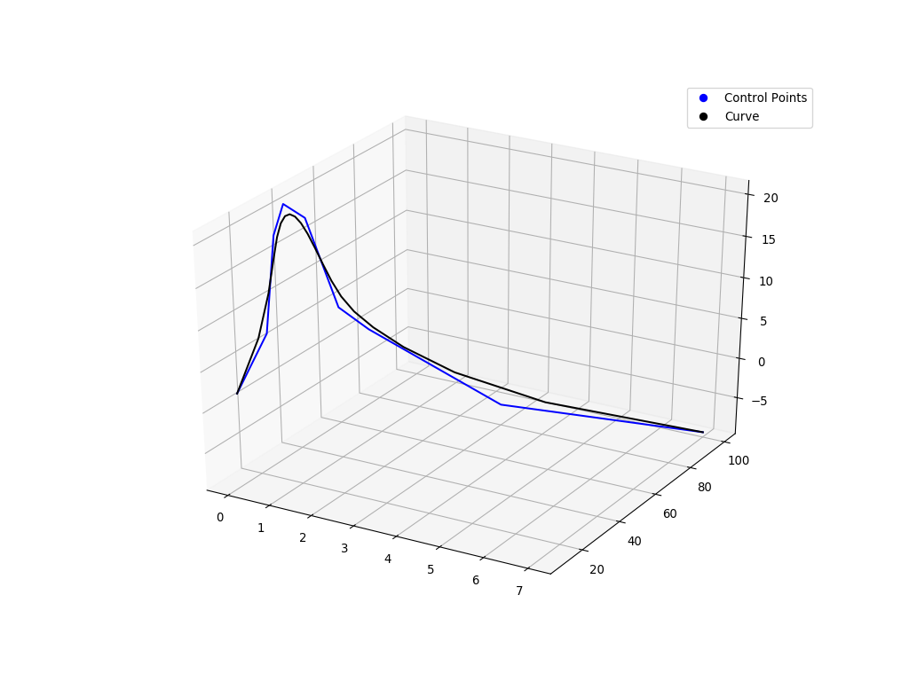
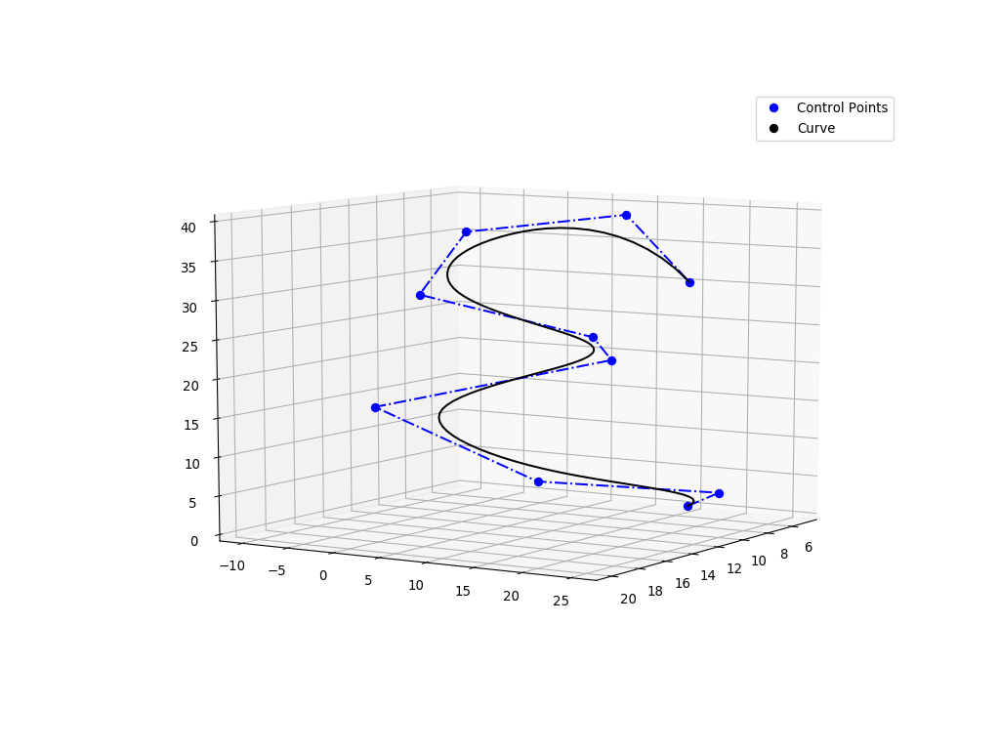
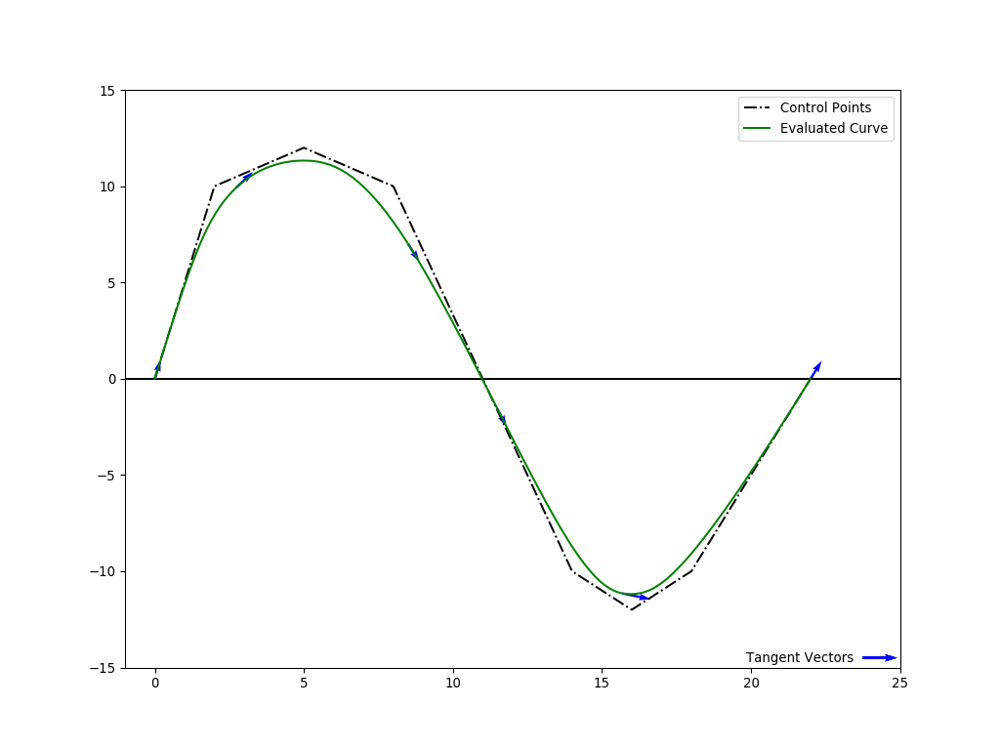
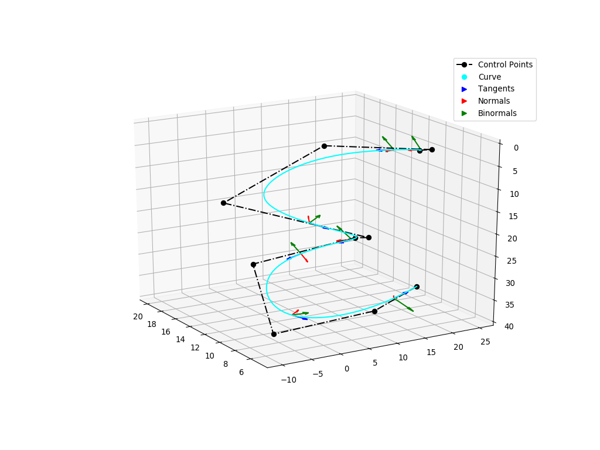

Visualization
^^^^^^^^^^^^^

Visualization Component
=======================

NURBS-Python v3.x series include a visualization module for plotting evaluated curves and surfaces. Examples_
repository contains some examples on how to use the visualization component with surfaces and 2D/3D curves.

Advanced Visualization Options
==============================

``visualization/`` directory in the Examples_ repository contains customizable scripts for more advanced visualization
options using `Matplotlib <https://matplotlib.org>`_.

Visualization Examples
======================

The following examples illustrate the visualization component which comes with the NURBS-Python package and
the advanced visualization options using the scripts in the Examples_ repository.

Surfaces
--------

The following figures are generated using `Matplotlib v2.1.0 <https://matplotlib.org>`_ from the outputs of the examples
shared in the Examples_ repository. Please see :doc:`File Formats <file_formats>` section on details of CSV exporting
capabilities. Visualization scripts can be found in the Examples_ repository under ``visualization`` directory.

ex_surface01.py
~~~~~~~~~~~~~~~

* Control points CSV export mode: ``wireframe``
* Surface points CSV export mode: ``linear``
* Evaluation delta: 0.05
* Script used: ``mpl_wframe_trisurf.py``

.. image:: images/ex_surface01_mpl.png
    :alt: Surface example 1

-----

* Control points CSV export mode: ``wireframe``
* Surface points CSV export mode: ``wireframe``
* Evaluation delta: 0.005
* Script used: ``mpl_wframe_wframe.py``

ex_surface02.py
~~~~~~~~~~~~~~~

* Control points CSV export mode: ``wireframe``
* Surface points CSV export mode: ``linear``
* Evaluation delta: 0.05
* Script used: ``mpl_wframe_trisurf.py``

.. image:: images/ex_surface02_mpl.png
    :alt: Surface example 2

ex_surface03.py
~~~~~~~~~~~~~~~

* Control points CSV export mode: ``linear``
* Surface points CSV export mode: ``wireframe``
* Evaluation delta: 0.05
* Script used: ``mpl_scatter_wframe.py``

.. image:: images/ex_surface03_mpl.png
    :alt: Surface example 3

mpl_trisurf_vectors.py
~~~~~~~~~~~~~~~~~~~~~~

The following figure illustrates tangent and normal vectors on ``ex_surface02.py`` example.
The example script can be found in Examples_ repository under the ``visualization`` directory.

2D Curves
---------

The following examples illustrate the direct output of the visualization component, ``geomdl.visualization`` for 2D
curves.

ex_curve01.py
~~~~~~~~~~~~~

ex_curve02.py
~~~~~~~~~~~~~

ex_curve03.py
~~~~~~~~~~~~~

ex_curve04.py
~~~~~~~~~~~~~

3D Curves
---------

The following examples illustrate the direct output of the visualization component, ``geomdl.visualization`` for 3D
curves.

ex_curve3d01.py
~~~~~~~~~~~~~~~

ex_curve3d02.py
~~~~~~~~~~~~~~~

Advanced Visualization for 2D/3D Curves
---------------------------------------

The following example scripts can be found in Examples_ repository under the ``visualization`` directory.

mpl_curve2d_tangents.py
~~~~~~~~~~~~~~~~~~~~~~~

This example illustrates a more advanced visualization option for plotting the 2D curve tangents alongside with the
control points grid and the evaluated curve.

mpl_curve3d_tangents.py
~~~~~~~~~~~~~~~~~~~~~~~

This example illustrates a more advanced visualization option for plotting the 3D curve tangents alongside with the
control points grid and the evaluated curve.

.. image:: images/ex_curve3d01_mpl.png
    :alt: 3D curve example 1 with tangent vector quiver plots

mpl_curve3d_vectors.py
~~~~~~~~~~~~~~~~~~~~~~

This example illustrates a visualization option for plotting the 3D curve tangent, normal and binnormal vectors
alongside with the control points grid and the evaluated curve.

Please note that binormal vector evaluation method for the curves is added on version *3.0.6*.

.. _Examples: https://github.com/orbingol/NURBS-Python_Examples
