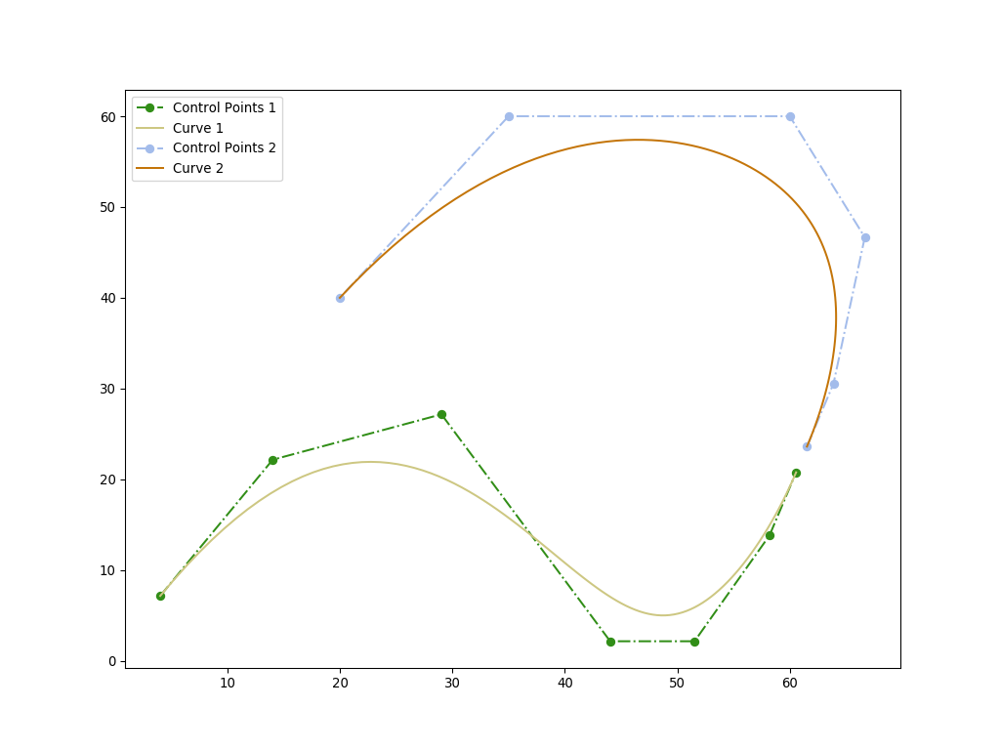
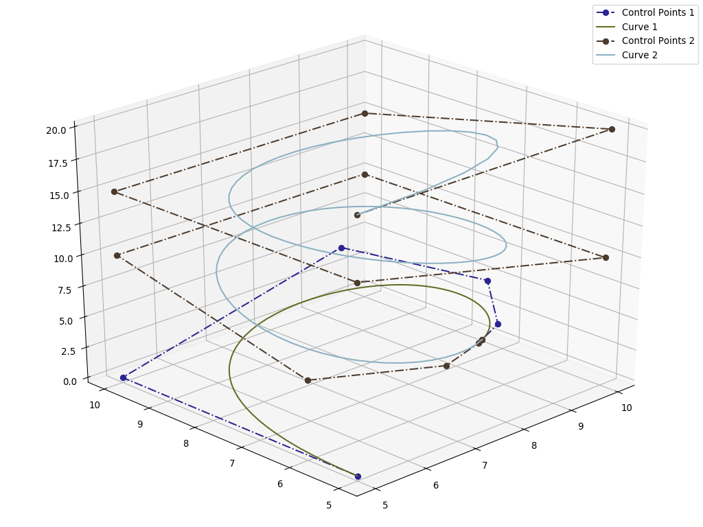
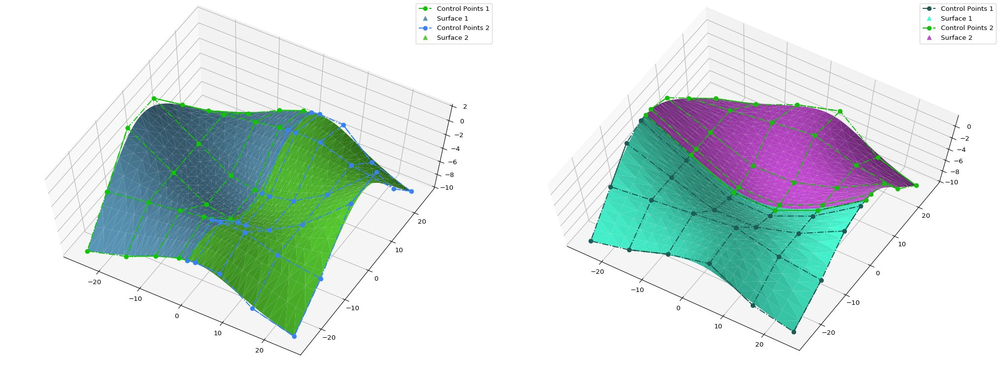
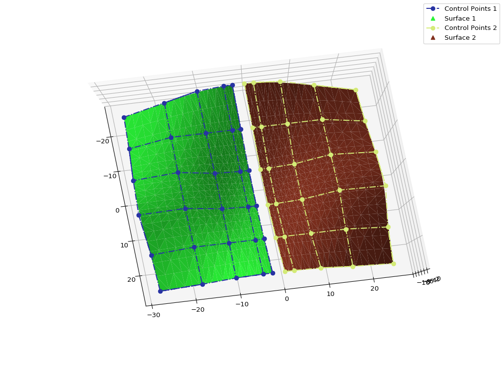
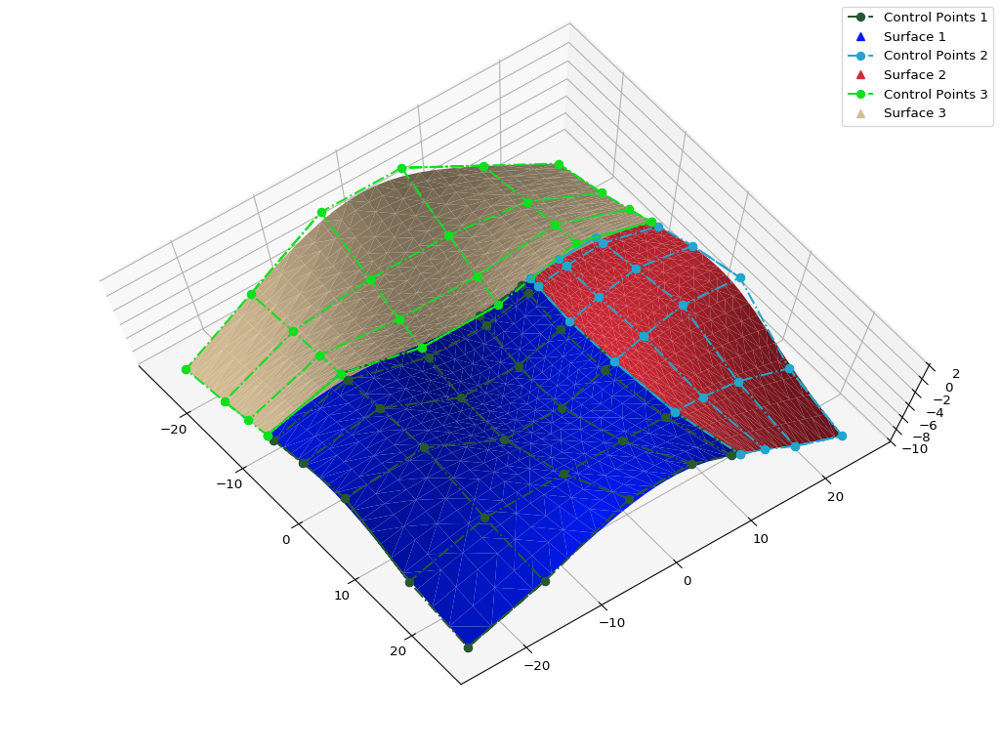
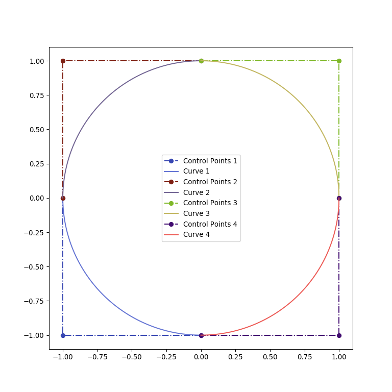
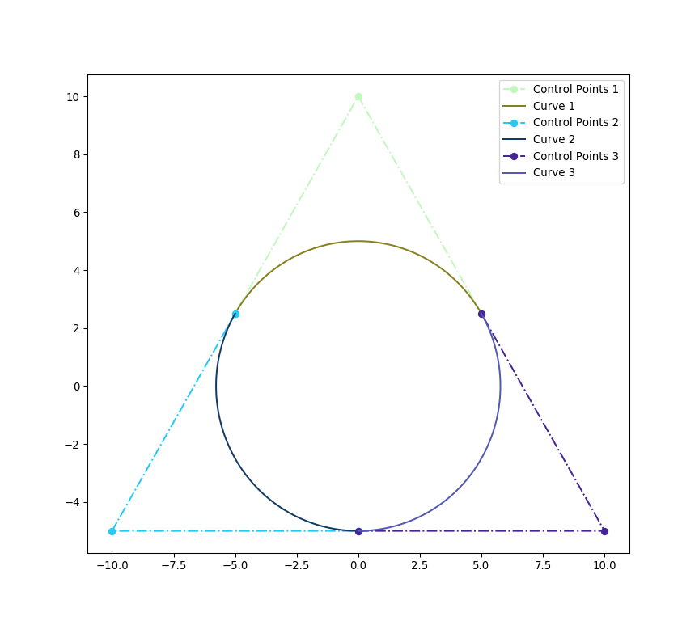
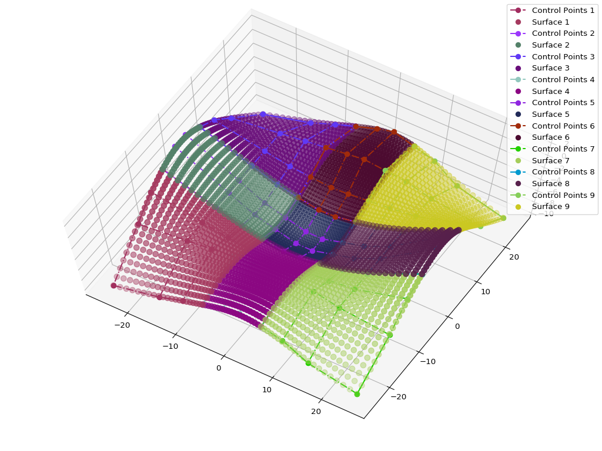
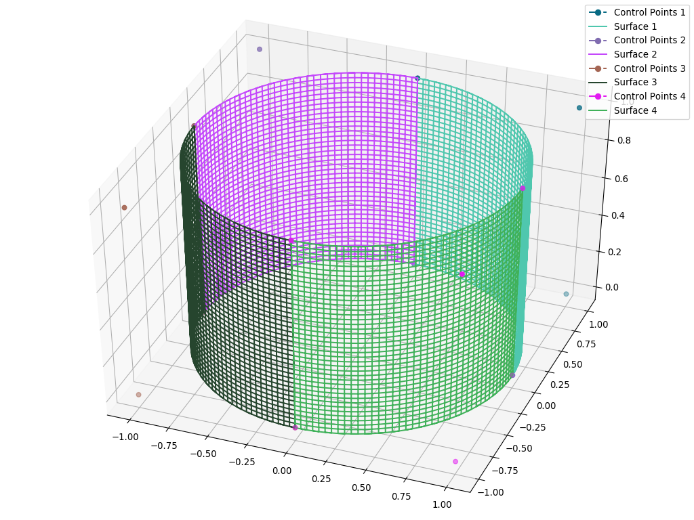

Splitting and Decomposition
^^^^^^^^^^^^^^^^^^^^^^^^^^^

NURBS-Python is also capable of splitting the curves and the surfaces, as well as applying Bézier decomposition.
Splitting of 2D/3D curves can be achieved via ``split()`` method. For the surfaces, there are 2 different splitting
methods, ``split_u()`` for splitting the surface in U-direction and ``split_v()`` for V-direction. Bézier decomposition
can be applied via ``decompose()`` method for all curve and surface classes. Please refer to the documentation for more
details.

The following figures are generated from the examples provided in the Examples_ repository.

Splitting
=========

The following 2D curve is split at ``u = 0.6`` and applied translation by the tangent vector via ``translate()`` method.

Splitting can also be applied to 3D curves (split at ``u = 0.3``) without any translation.

Surface splitting is also possible. The following figure compares splitting at ``u = 0.5`` and ``v = 0.5``.

Surfaces can also be translated too before or after splitting operation. The following figure illustrates translation
after splitting the surface at ``u = 0.5``.

Multiple splitting is also possible for all curves and surfaces. The following figure describes multi splitting in
surfaces. The initial surface is split at ``u = 0.25`` and then, one of the resultant surfaces is split at ``v = 0.75``,
finally resulting 3 surfaces.

Bézier Decomposition
====================

The following figures illustrate Bézier cecomposition capabilities of NURBS-Python. Let's start with the most obvious
one, a full circle with 9 control points. It also is possible to directly  generate this shape via ``geomdl.shapes``
module.

The following is a circular curve generated with 7 control points as illustrated on page 301 of *The NURBS Book*
(2nd Edition) by Piegl and Tiller. There is also an option to generate this shape via ``geomdl.shapes`` module.

The following figures illustrate the possibility of Bézier decomposition in B-Spline and NURBS surfaces.

The colors are randomly generated via :py:func:`utilities.color_generator()` function.

.. _Examples: https://github.com/orbingol/NURBS-Python_Examples
